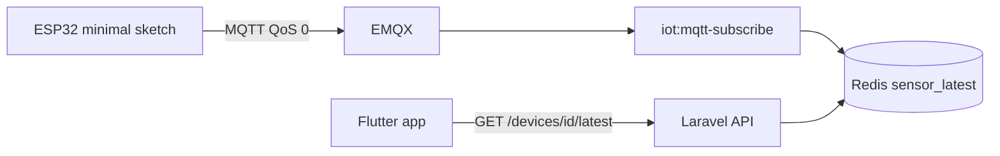

# Ashmawy ESP32 Sensor Publish Minimal — guide for app & embedded teams

**Sketch:** [`AshmawyEsp32SensorPublishMinimal.ino`](./AshmawyEsp32SensorPublishMinimal.ino)

| Audience | Use this doc for |
|----------|----------------|
| **Flutter / mobile** | How to read live sensor data from the API (no heartbeat required with this firmware). |
| **Embedded** | Flash, MQTT topics, payload format, credentials, Serial debugging. |
| **Backend / DevOps** | What must run on the server for `/latest` to update. |

**Production customer sites:** use [`AshmawyEsp32Hybrid`](../AshmawyEsp32Hybrid/AshmawyEsp32Hybrid.ino) (on-demand sensors + door lock + push alerts).  
**This minimal sketch:** always publishes sensors — best for **lab**, **QA**, and **first `/latest` integration**.

---

## 1. What this firmware does



- Connects to Wi‑Fi and MQTT once, then **publishes every 10 seconds** (configurable).
- Publishes four demo sensor types: `temperature`, `counter`, `motion`, `door_status`.
- Each message includes **`seq`** (incrementing) so the backend always accepts updates.
- **Does not** subscribe to `app/heartbeat` or `component/.../set` (no lock control in this sketch).

---

## 2. Flutter app — how to show live data

### 2.1 You do **not** need app heartbeat for this firmware

With **minimal** firmware, sensors run 24/7. The mobile app can poll directly:

| Step | API |
|------|-----|
| Login | `POST /api/v1/iot/auth/login` |
| List devices | `GET /api/v1/iot/devices` |
| Live sensors | `GET /api/v1/iot/devices/{id}/latest` |

Use **`iot_devices.id`** from the list (integer, e.g. `2`) — **not** `iot_user_id`.

### 2.2 Example (Dart)

```dart
Future<Map<String, dynamic>> fetchLatest(int deviceId, String bearer) async {
  final res = await http.get(
    Uri.parse('$baseUrl/api/v1/iot/devices/$deviceId/latest'),
    headers: {'Authorization': 'Bearer $bearer'},
  );
  if (res.statusCode != 200) throw Exception('latest failed: ${res.statusCode}');
  return jsonDecode(res.body) as Map<String, dynamic>;
}
```

Parse `data` array: each item has `type`, `value`, `recorded_at`.  
Check `meta.source`: `redis` = live; `database` or `none` = see troubleshooting below.

### 2.3 Polling interval

- While device screen is open: every **10–15 seconds** (firmware publishes every **10 s** by default).
- No need for `POST .../app/heartbeat` unless you switch firmware to **Hybrid**.

### 2.3 Auth rules

| Token | Use for |
|-------|---------|
| Passport Bearer from `auth/login` | All REST API calls |
| Device MQTT JWT | **ESP32 only** — never put in `Authorization: Bearer` |

Full mobile guide: [`iot-mobile-app-guide.md`](../../iot-mobile-app-guide.md).

---

## 3. MQTT contract (embedded + backend)

### 3.1 Topic pattern

```text
iot/{iot_user_id}/{device_uuid}/sensor/{type}
```

Example:

```text
iot/1/20e1196d-a31e-43ef-b092-2a21851ffa2a/sensor/temperature
```

| Constant in sketch | Database / API field |
|--------------------|----------------------|
| `IOT_USER_ID` | `iot_users.id` (numeric string) |
| `DEVICE_UUID` | `iot_devices.device_uuid` |
| `MQTT_USERNAME` | `iot_devices.mqtt_username` |
| `MQTT_PASSWORD` | Device JWT from regenerate |

### 3.2 Payload (required shape)

```json
{"v": 21.9, "seq": 42}
```

| Field | Rule |
|-------|------|
| `v` | Number, bool, or string depending on sensor |
| `seq` | Monotonic counter — **must change** when value changes |

QoS: **0** (telemetry).

### 3.3 Sensor types in this demo

| MQTT `type` | Demo `v` | Typical UI |
|-------------|----------|------------|
| `temperature` | float | °C |
| `counter` | int 0–100 | counter widget |
| `motion` | bool | motion on/off |
| `door_status` | `"door open"` / `"door closed"` | status text |

Register matching types in the installer dashboard (`/iot/devices/{id}`) or they still ingest but may be easier to manage with explicit sensor slots.

---

## 4. Configure & flash (embedded)

### 4.1 Arduino IDE

1. Board: **ESP32** (your module, e.g. ESP32-S3).
2. Libraries: **MQTT** (256dpi), **ArduinoJson** v6.
3. Edit top of `.ino`: Wi‑Fi, `MQTT_HOST`, credentials, `IOT_USER_ID`, `DEVICE_UUID`.
4. Upload; Serial Monitor **115200 baud**.

### 4.2 Get credentials

1. Log in to IoT web: `/iot/login`
2. Open customer site → copy **UUID**, **MQTT user**, **JWT password** (regenerate if missing).
3. Paste into sketch — **do not** use `password1234` or Laravel bridge user.

### 4.3 Timing

```cpp
static const unsigned long SENSOR_PUBLISH_MS = 10000UL;  // 10 s
```

---

## 5. Serial log cheat sheet

| Log | Meaning |
|-----|---------|
| `[MQTT] connected (sensor minimal)` | Ready to publish |
| `[PUB] iot/1/.../sensor/temperature` | Message sent |
| `[MQTT] connect failed` | Wrong JWT, ACL, or broker down |
| No `[PUB]` after connect | Wi‑Fi/MQTT dropped — check loop |

---

## 6. Backend checklist (DevOps)

For `/latest` to return fresh data:

| Requirement | Setting |
|-------------|---------|
| MQTT subscriber running 24/7 | `php artisan iot:mqtt-subscribe` (supervised) |
| Demand gating off for always-on ingest | `IOT_SUBSCRIBER_DEMAND_GATED=false` |
| Fast path to Redis | `IOT_SENSOR_PROCESS_INLINE=true` (recommended) |
| EMQX JWT | Same `IOT_JWT_SECRET` as Laravel |
| Redis | `REDIS_HOST` reachable |

See [`iot-platform.md`](../../iot-platform.md).

---

## 7. Troubleshooting

| Symptom | Check |
|---------|--------|
| App `latest` empty | `iot:mqtt-subscribe` running; device id correct; Redis up |
| `meta.source: none` | No MQTT ingest — firmware topic vs DB `iot_user_id` / `device_uuid` |
| Values never change | `seq` must increment (sketch does this in `updateDemoValues`) |
| `rc=5` on MQTT | Regenerate device JWT; fix `MQTT_USERNAME` |
| Worked then stopped | If `IOT_SUBSCRIBER_DEMAND_GATED=true`, subscriber sleeps without heartbeat — use `false` for this sketch |
| 401 on API | Re-login Flutter; do not use MQTT JWT as Bearer |

---

## 8. Minimal vs Hybrid (which firmware when)

| Feature | **Sensor minimal** (this) | **Hybrid** |
|---------|----------------------------|------------|
| Sensors always on | Yes | Only while app heartbeat active |
| Door lock commands | No | Yes |
| FCM when app closed | No (still publishes `door_status`) | Yes (critical path) |
| App heartbeat API | Not required | Required for live charts |
| Power / bandwidth | Higher | Lower |

When moving from minimal → hybrid, update Flutter to call `POST .../app/heartbeat` — see [`ESP32_APP_HEARTBEAT.md`](../ESP32_APP_HEARTBEAT.md).

---

## 9. Related files

| File | Purpose |
|------|---------|
| [`AshmawyEsp32SensorPublishMinimal.ino`](./AshmawyEsp32SensorPublishMinimal.ino) | This sketch |
| [`AshmawyEsp32Hybrid`](../AshmawyEsp32Hybrid/AshmawyEsp32Hybrid.ino) | Production firmware |
| [`iot-mobile-app-guide.md`](../../iot-mobile-app-guide.md) | Flutter API + heartbeat |
| [`iot-platform.md`](../../iot-platform.md) | Full platform reference |
| Postman | `postman/Ashmawy-Iot-Flutter-API.postman_collection.json` |
