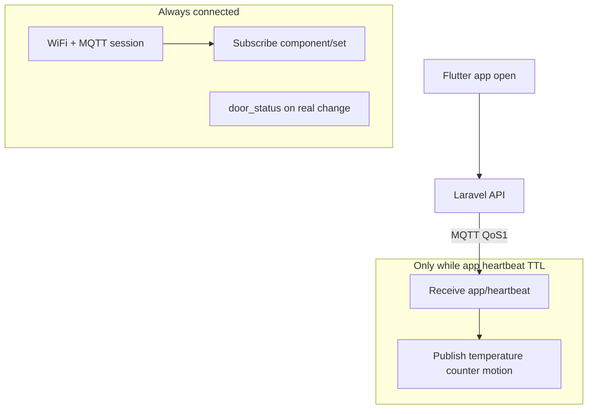

# ESP32 Hybrid firmware — embedded engineer guide

**Sketch:** [`AshmawyEsp32Hybrid/AshmawyEsp32Hybrid.ino`](./AshmawyEsp32Hybrid/AshmawyEsp32Hybrid.ino)  
**Backend contract:** [iot-platform.md](../iot-platform.md)  
**Mobile app:** [iot-mobile-app-guide.md](../iot-mobile-app-guide.md)  
**Short MQTT reference:** [ESP32_APP_HEARTBEAT.md](./ESP32_APP_HEARTBEAT.md)

---

## 1. What this system does

Ashmawy IoT uses **three separate behaviors** on one ESP32. Do not mix them up.

| Mode | When it runs | ESP32 action | Goal |
|------|----------------|--------------|------|
| **A. Telemetry (on-demand)** | Mobile app is open / foreground | Publish `temperature`, `counter`, `motion`, periodic `door_status` every ~5 s | Save Wi‑Fi and CPU when nobody is watching |
| **B. Commands (always on)** | Any time, app open or closed | Subscribe to `.../component/{ch}/set`, drive relay, publish `.../status` with `command_ack` | Lock/unlock must work immediately |
| **C. Critical alerts (always on)** | Door state changes | Publish `door_status` immediately (even if telemetry is off) | Server can send push notification if app is closed |

**Important:** “Sleep” in this design means **stop the sensor publish timer**. Wi‑Fi and MQTT stay connected so commands still work.



---

## 2. End-to-end flow

### 2.1 App opens (start telemetry)

1. User opens device screen in Flutter.
2. App calls: `POST /api/v1/iot/devices/{device_id}/app/heartbeat`  
   Body: `{ "streaming": true, "ttl_seconds": 300 }`
3. Laravel publishes to MQTT topic:  
   `iot/{iot_user_id}/{device_uuid}/app/heartbeat`
4. ESP32 receives JSON, sets internal timer `streamUntilMs = now + ttl_seconds`.
5. ESP32 publishes sensor topics every `SENSOR_PUBLISH_MS` (default 5 s).
6. Laravel ingests `.../sensor/{type}` → Redis → app reads `GET .../latest`.

### 2.2 App closes (stop telemetry)

Two ways to stop periodic sensors:

| Method | Who | What happens |
|--------|-----|----------------|
| **Recommended** | Flutter on `paused` / dispose | `POST .../app/heartbeat` with `{ "streaming": false }` → ESP calls `stopStreaming()` immediately |
| **Fallback** | Nobody | ESP stops when `millis() >= streamUntilMs` (TTL from last heartbeat, default **300 s**) |

If you close the app for **2 minutes** but TTL was **300 s**, the ESP will **still publish** until TTL expires or Flutter sends `streaming: false`. That is expected.

### 2.3 Door / lock command (any time)

1. App: `POST .../components/{component_id}/action` with `ON` / `OFF` / `TOGGLE`.
2. Laravel publishes QoS 1 to `.../component/{channel}/set`.
3. ESP32 `handleComponentSet()` runs relay, publishes `.../component/{channel}/status` with `command_ack: true` and same `message_id` as the command.
4. API waits for ACK (see platform doc).

### 2.4 Critical door alert (app closed)

When the physical door state changes (demo: `testBool` toggles; production: your GPIO), firmware calls `publishDoorStatusCritical()` **without** checking `streamingActive()`. Server may send FCM push if the app session is inactive.

---

## 3. MQTT topics (this device)

Replace placeholders with values from the database / API.

| Direction | Topic | QoS | Payload |
|-----------|--------|-----|---------|
| Server → ESP | `iot/{iot_user_id}/{device_uuid}/app/heartbeat` | 1 | See §4 |
| Server → ESP | `iot/{iot_user_id}/{device_uuid}/component/{channel}/set` | 1 | `action`, `message_id`, `ts` |
| ESP → Server | `iot/{iot_user_id}/{device_uuid}/component/{channel}/status` | 1 | `state`, `command_ack`, `message_id`, … |
| ESP → Server | `iot/{iot_user_id}/{device_uuid}/sensor/{type}` | 0 | `{"v": ..., "seq": N}` |
| ESP → Server | `iot/{iot_user_id}/{device_uuid}/device/status` | 1 | Optional online banner |

Example for device **#2**:

```text
iot/1/20e1196d-a31e-43ef-b092-2a21851ffa2a/app/heartbeat
iot/1/20e1196d-a31e-43ef-b092-2a21851ffa2a/component/1/set
iot/1/20e1196d-a31e-43ef-b092-2a21851ffa2a/sensor/temperature
```

---

## 4. App heartbeat JSON (server → ESP)

```json
{
  "streaming": true,
  "ttl_seconds": 300,
  "message_id": "550e8400-e29b-41d4-a716-446655440000",
  "ts": "2026-05-20T12:00:00+00:00"
}
```

| Field | Meaning |
|-------|---------|
| `streaming` | `true` = start/extend telemetry window; `false` = stop immediately |
| `ttl_seconds` | How long to keep publishing sensors if `streaming` is true (clamped 10–3600 on ESP) |
| `message_id` | Correlation UUID from Laravel (optional on ESP) |
| `ts` | ISO timestamp |

---

## 5. Sensor payload (ESP → server)

Every sensor message should include **`seq`** (monotonic counter) so the backend accepts updates:

```json
{"v": 21.5, "seq": 42}
```

```json
{"v": "door open", "seq": 43}
```

Sensor types used in the demo sketch:

| `type` | Demo source | Telemetry gating |
|--------|-------------|------------------|
| `temperature` | `testFloat` | Only while streaming |
| `counter` | `testInt` | Only while streaming |
| `motion` | `testBool` | Only while streaming |
| `door_status` | string open/closed | Periodic while streaming **and** immediate on change (critical) |

---

## 6. Configure the sketch before flash

Edit the top of [`AshmawyEsp32Hybrid.ino`](./AshmawyEsp32Hybrid/AshmawyEsp32Hybrid.ino):

### 6.1 Wi‑Fi

```cpp
static const char *WIFI_SSID = "YourNetwork";
static const char *WIFI_PASSWORD = "YourPassword";
```

### 6.2 MQTT broker

```cpp
static const char *MQTT_HOST = "72.61.106.84";  // EMQX host
static const uint16_t MQTT_PORT = 1883;
```

### 6.3 Device identity (must match database)

From `GET /api/v1/iot/devices/{id}` after login:

| Constant | API / DB field |
|----------|----------------|
| `IOT_USER_ID` | `iot_user_id` (string, e.g. `"1"`) |
| `DEVICE_UUID` | `device_uuid` (36-char UUID) |
| `MQTT_USERNAME` | `mqtt_username` (exact match) |
| `MQTT_CLIENT_ID` | same as `mqtt_username` (unique per board) |
| `MQTT_PASSWORD` | JWT from `POST .../devices/{id}/jwt/regenerate` |

**Do not** use the Laravel bridge user (`back-end`) on the ESP. Use the **device JWT**.

### 6.4 Hardware (door lock demo)

```cpp
static const int DOOR_COMPONENT_CHANNEL = 1;  // iot_components.channel
static const int RELAY_IN_PIN = 4;            // GPIO → relay IN
static const bool RELAY_ACTIVE_HIGH = true; // H jumper on relay module
```

### 6.5 Timing

```cpp
static const unsigned long SENSOR_PUBLISH_MS = 5000UL;  // telemetry interval while streaming
```

---

## 7. Code structure (how the .ino works)

### 7.1 Global state

| Symbol | Purpose |
|--------|---------|
| `streamUntilMs` | `millis()` deadline; telemetry allowed while `millis() < streamUntilMs` |
| `lastPublishMs` | Last periodic telemetry burst |
| `gAppHeartbeatTopic` | Built as `{prefix}/app/heartbeat` |
| `gSetTopicBuf` | `{prefix}/component/{ch}/set` |
| `doorLocked` | Logical lock state → relay |

### 7.2 `streamingActive()`

```cpp
return streamUntilMs != 0 && millis() < streamUntilMs;
```

When false, `loop()` does **not** call `publishTelemetryBurst()`.

### 7.3 `handleAppHeartbeat()`

- `streaming: true` → `extendStreaming(ttl)` + one immediate `publishTelemetryBurst()`
- `streaming: false` → `stopStreaming()` (stops periodic sensors)

### 7.4 `loop()`

```text
connect WiFi → connect MQTT → mqtt.loop()
if (streamingActive() && interval elapsed)
    publishTelemetryBurst()   // temperature, counter, motion, door_status
```

Commands are handled inside `mqtt.loop()` via `onMessageAdvanced` → `handleComponentSet()`.

### 7.5 `publishDoorStatusCritical()`

Bypasses streaming gate. Used when:

- Demo door state flips in `updateDemoValues()`
- Lock command changes door open/closed in `applyLockCommand()`

**Production tip:** Call this from your real door sensor ISR or GPIO read, not from the demo toggle.

### 7.6 Component ACK

`publishDoorComponentStatus()` must set:

- `command_ack: true` when the relay actually moved
- `message_id` = same UUID Laravel sent in `.../set`

Without `message_id`, the mobile API returns **504 device_ack_timeout**.

---

## 8. Arduino IDE setup

1. Board: **ESP32** (e.g. ESP32-S3 as in your logs).
2. Libraries (Library Manager):
   - **MQTT** by 256dpi
   - **ArduinoJson** v6
3. Open `AshmawyEsp32Hybrid.ino`, configure §6, upload.
4. Serial Monitor **115200 baud**.

---

## 9. Serial log cheat sheet

| Log | Meaning |
|-----|---------|
| `[MQTT] connected (hybrid)` | Subscribed to heartbeat + component/set |
| `[HB] streaming=1 ttl=300` | *(add Serial in handleAppHeartbeat if needed)* |
| `[STREAM] active 300 s` | Telemetry window started |
| `[STREAM] stopped` | Telemetry stopped (`streaming: false` or you can add expiry log) |
| `[PUB] iot/1/.../sensor/temperature` | Sensor published |
| `[MQTT] retry rc=5` | Auth/ACL failure — fix JWT / username |
| No `[PUB]` for 5+ s after close | Good — telemetry stopped |

After app heartbeat with `streaming: false`, you should see `[STREAM] stopped` and **no** repeating `[PUB] .../sensor/temperature` every 5 s.

---

## 10. Testing checklist (embedded)

1. **MQTT connect** — `[MQTT] connected` with device JWT.
2. **No heartbeat** — wait 30 s: no periodic `[PUB]` for temperature (door critical may still fire once if demo toggles).
3. **Postman / API heartbeat** — `streaming: true`, `ttl_seconds: 120` → `[STREAM] active 120 s` and `[PUB]` every 5 s.
4. **Stop** — `streaming: false` → `[STREAM] stopped`, no more temperature `[PUB]`.
5. **Lock without app** — Postman `component/action` ON/OFF while telemetry off → relay clicks, status published.
6. **Door critical** — change door input → `[PUB] .../sensor/door_status` even when stream stopped.

---

## 11. Replacing demo sensors with real hardware

| Demo variable | Replace with |
|---------------|--------------|
| `testFloat` | DHT22, DS18B20, etc. |
| `testInt` | pulse counter, energy meter |
| `testBool` | PIR motion |
| `door_status` | magnetic reed, limit switch on door |

Keep the pattern:

1. Read sensor in `loop()` or timer.
2. For **non-critical** types: only publish inside `publishTelemetryBurst()` when `streamingActive()`.
3. For **critical** types: on edge detection, call `publishSensorString("door_status", ...)` or dedicated helper with new `seq`.

Always increment **`publishSeq`** (or per-type seq) on each publish.

---

## 12. What we deliberately do not do (v1)

- **Deep sleep** / WiFi off — would break instant lock commands.
- **Disconnect MQTT** when app closes — same reason.
- **LWT / retained** sensor messages — not required for current backend.

---

## 13. Troubleshooting

| Problem | Check |
|---------|--------|
| Sensors never start | App heartbeat not sent; EMQX ACL; wrong `app/heartbeat` subscription |
| Sensors never stop after app close | Flutter must send `streaming: false`; or wait full TTL (300 s default) |
| Lock works, sensors don’t | Expected without heartbeat — by design |
| `rc=5` on connect | `MQTT_USERNAME` / JWT mismatch; EMQX `IOT_JWT_SECRET` |
| API shows old values | Server `iot:mqtt-subscribe` running; use device id `2` in API |
| Duplicate door_status | Demo toggles `testBool` every burst — fix when using real GPIO |

---

## 14. Related files in repo

| File | Role |
|------|------|
| [`AshmawyEsp32Hybrid.ino`](./AshmawyEsp32Hybrid/AshmawyEsp32Hybrid.ino) | Production-oriented hybrid sketch |
| [`AshmawyEsp32DoorLockDemo.ino`](./AshmawyEsp32DoorLockDemo/AshmawyEsp32DoorLockDemo.ino) | Lock + ACK only (always on) |
| [`AshmawyEsp32SensorPublishMinimal.ino`](./AshmawyEsp32SensorPublishMinimal/AshmawyEsp32SensorPublishMinimal.ino) | Always-on sensors (lab only) |
| [`AshmawyEsp32HomeHubDemo.ino`](./AshmawyEsp32HomeHubDemo/AshmawyEsp32HomeHubDemo.ino) | Multi-relay hub |

---

## 15. Quick reference — who must do what

| Role | Responsibility |
|------|----------------|
| **Embedded** | Flash hybrid sketch; device JWT; GPIO/relay; critical vs telemetry paths |
| **Mobile** | Heartbeat on resume; `streaming: false` on pause; poll `/latest`; register FCM token |
| **Backend** | Keep `iot:mqtt-subscribe` running; `IOT_SENSOR_PROCESS_INLINE=true`; EMQX JWT auth |

For questions about API or Redis, see [iot-platform.md](../iot-platform.md). For Flutter lifecycle, see [iot-mobile-app-guide.md](../iot-mobile-app-guide.md).
