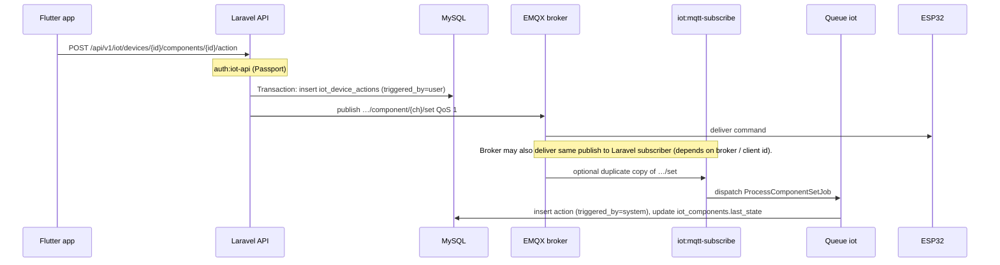
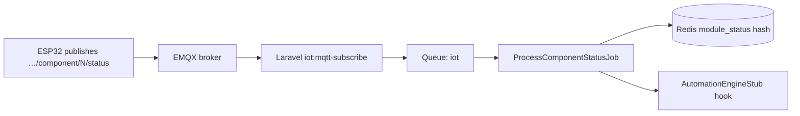
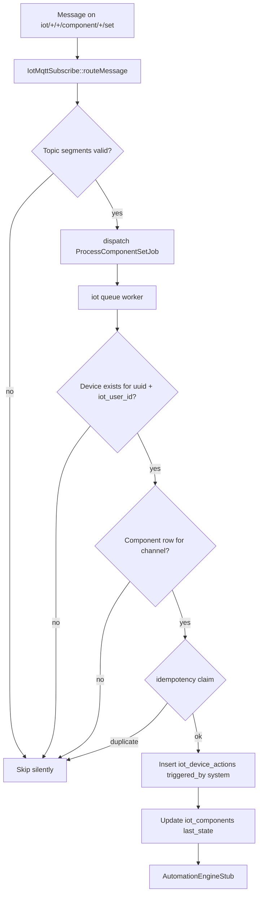
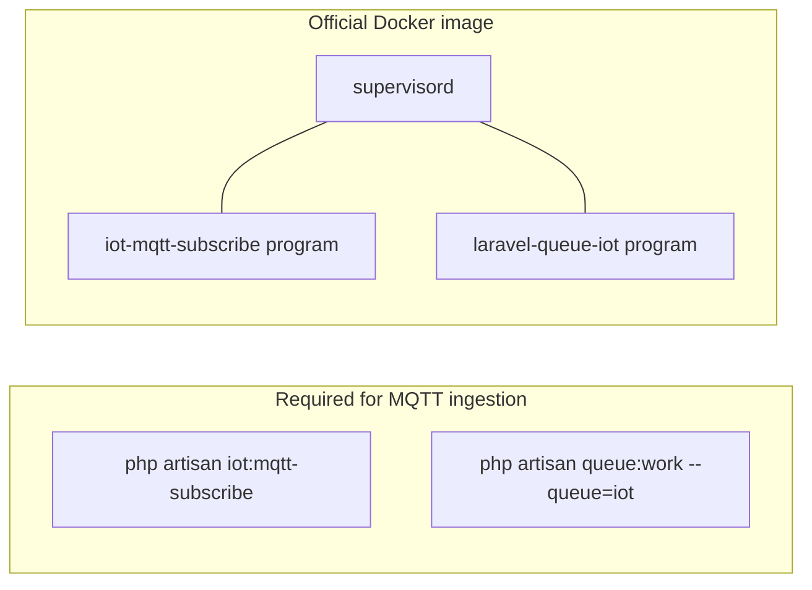

# IoT components: how the backend receives and sends MQTT messages

This document explains **how Ashmawy Tech’s Laravel backend handles component topics** (`…/component/{channel}/set` and `…/component/{channel}/status`), how that relates to the **Flutter API**, **Redis**, and **MySQL**, and what must be running in production.

---

## 1. Mental model (two directions)

| Direction | Who publishes | Topic pattern | What Laravel does |
|-----------|----------------|---------------|-------------------|
| **App → device (command)** | Backend (`MqttPublisherService`) | `iot/{iot_user_id}/{device_uuid}/component/{channel}/set` | Publishes JSON after an authenticated API call (QoS 1). Device (ESP32) **subscribes** here. |
| **Device → backend (`set` echo / bridge)** | Anyone on the broker | Same `…/set` | Long-running **`iot:mqtt-subscribe`** receives it → **`ProcessComponentSetJob`** → MySQL **actions** + component **`last_state`**. |
| **Device → backend (status / ack)** | Device | `iot/{iot_user_id}/{device_uuid}/component/{channel}/status` | Subscriber → **`ProcessComponentStatusJob`** → **Redis** module snapshot → Flutter reads latest via device API. |

Important:

- **`iot_user_id`** is the primary key of **`iot_users`** (not your main app user unless they are the same conceptually).
- **`device_uuid`** must match **`iot_devices.device_uuid`** for that user.
- **`channel`** must match **`iot_components.channel`** for that device (`iot_components.iot_device_id` + `channel`).

---

## 2. End-to-end flow (Flutter locks door → ESP receives)



Code paths:

- Route: `routes/api.php` → `POST devices/{device}/components/{component}/action`
- Controller: `App\Http\Controllers\Api\V1\Iot\ComponentController::action`
- Service: `App\Services\Iot\ComponentControlService::execute`
- MQTT publish: `App\Services\Iot\MqttPublisherService::publishComponentCommand`

Allowed actions from the API today: **`ON`**, **`OFF`**, **`TOGGLE`**, **`SET`** (see `ComponentControlService`). Custom strings such as `CLEAR_ALARM` require extending validation if you want them from the app.

---

## 3. Flow: ESP publishes component status (ack / relay state)



After the job runs, Flutter can load latest module snapshots from the API (device detail / realtime layer backed by Redis).

Implementation highlights:

- Subscription QoS for telemetry topics (including `…/status`) is **at most once** in `IotMqttSubscribe`; device may still publish QoS 1 — broker accepts both.
- Idempotency: **`IotMessageIdempotency`** dedupes by `sha256(topic + '|' + payload)` **after** the device row is resolved (see jobs).

---

## 4. Flow: MQTT `…/set` message picked up by Laravel subscriber



Source: `App\Console\Commands\IotMqttSubscribe::routeMessage` → `App\Jobs\Iot\ProcessComponentSetJob::handle`.

---

## 5. Topic parsing (how Laravel decides which job runs)

Topics must start with:

```text
iot/{iot_user_id}/{device_uuid}/...
```

Then:

| Segment pattern | Job |
|-----------------|-----|
| `component/{channel}/set` | `ProcessComponentSetJob` |
| `component/{channel}/status` | `ProcessComponentStatusJob` |
| `sensor/{type}` or `sensor/a/b` | `ProcessSensorDataJob` |
| `device/status` | `ProcessDeviceStatusJob` |

Helpers: `App\Support\Iot\IotTopic`.

---

## 6. Redis keys for component **status** (not `set`)

Latest per-channel payloads are stored under prefix **`config('iot.redis_key_prefix')`** (default `iot:v1`):

```text
{prefix}:device:{iot_device_pk}:module_status
```

Each hash field is the **channel number** (string); value is JSON with `payload`, `recorded_at`, `message_id`.

Writer: `App\Services\Iot\IotRealtimeStore::putModuleStatus`.

---

## 7. MySQL tables touched by components

| Table | When |
|-------|------|
| `iot_device_actions` | API action (`triggered_by=user`) and/or MQTT `set` job (`triggered_by=system`) |
| `iot_components` | `last_state` / `last_state_at` updated from **`ProcessComponentSetJob`** |

---

## 8. What must run on the server



Without **both** the subscriber and a worker consuming the **`iot`** queue, messages will not become Redis/MySQL updates.

---

## 9. Reference: core PHP classes

| Role | Class |
|------|--------|
| MQTT subscribe loop | `App\Console\Commands\IotMqttSubscribe` |
| Publish commands to devices | `App\Services\Iot\MqttPublisherService` |
| API orchestration | `App\Services\Iot\ComponentControlService` |
| Jobs | `App\Jobs\Iot\ProcessComponentSetJob`, `ProcessComponentStatusJob` |
| Redis snapshots | `App\Services\Iot\IotRealtimeStore` |
| Topic strings | `App\Support\Iot\IotTopic` |

---

## 10. Payload shapes (contract)

**Backend → device (`…/set`)** — built in `MqttPublisherService`:

```json
{
  "action": "ON",
  "value": null,
  "message_id": "uuid-v4",
  "ts": "2026-05-09T12:00:00+00:00"
}
```

**Device → backend (`…/status`)** — free-form JSON stored under Redis `payload`; commonly includes `state`, `message_id`, `ts` (see project ESP integration guide).

---

This file is descriptive only; behavior follows the code in the paths above. If you change topic layouts or actions, update **`IotMqttSubscribe::routeMessage`**, **`ComponentControlService`**, and device firmware together.
