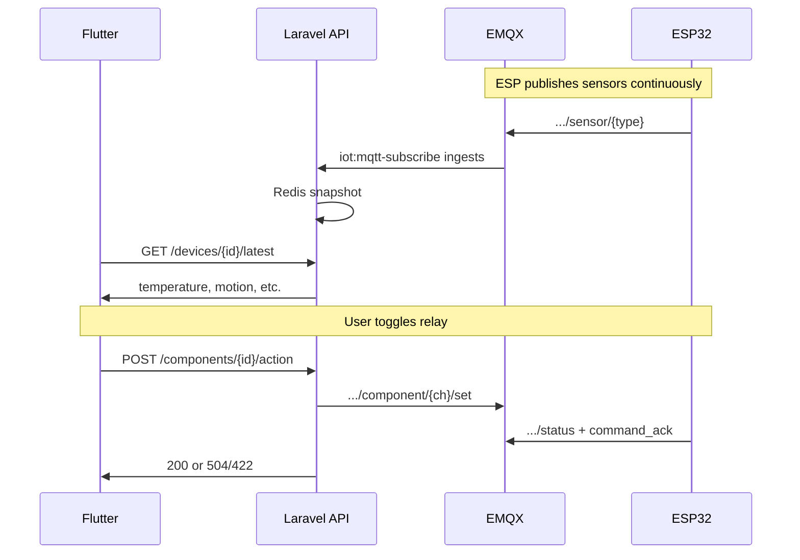

# Ashmawy IoT — Flutter: removed features (historical)

**Audience:** Flutter / mobile developers  
**Date:** May 2026  

> **Update:** App heartbeat and hybrid firmware were **re-implemented**. Use **[iot-mobile-app-guide.md](./iot-mobile-app-guide.md)** for current Flutter integration.

This document describes what was temporarily removed during a revert (May 2026). It is kept for history only.

> **Note:** This file is Markdown (`.md`). You can open it in Microsoft Word (*File → Open*) and **Save As → Word Document (.docx)** if you need a `.doc` for sharing.

---

## Summary (read first)

| Before (removed) | Now (current) |
|------------------|---------------|
| Call `POST .../devices/{id}/app/heartbeat` when opening a device screen | **Do not call** — endpoint returns **404** |
| ESP only publishes sensors after app heartbeat (`AshmawyEsp32SensorOnDemand`) | Use **always-on** firmware (`AshmawyEsp32IoT`, home hub, door lock demo) |
| Poll `/latest` only after heartbeat + 2–3 s delay | Poll **`GET .../devices/{id}/latest`** directly; data updates when ESP publishes |
| Optional: repeat app heartbeat every 2–3 min while screen visible | **Remove** timers / `Timer.periodic` for app heartbeat |

**Still valid (not removed):**

- All other `/api/v1/iot/*` endpoints (login, devices, components, actions, sensors, `/latest`)
- `POST /api/v1/iot/ingestion/heartbeat` — **different purpose** (server MQTT subscriber lease only; see §5)
- Command ACK behavior (`200` / `504` / `422` on `POST .../action`)
- `GET .../components/statuses` for live relay state

---

## 1. Removed API endpoint

### `POST /api/v1/iot/devices/{device_id}/app/heartbeat`

**Status:** **Removed** (not in `routes/api.php`).

**Purpose (when it existed):**

1. Laravel published an MQTT message to wake the ESP32 to stream sensors for a TTL window.
2. Laravel refreshed the **ingestion subscriber lease** in Redis (same as ingestion heartbeat).

**Headers (was):**

```
Authorization: Bearer <iot_access_token>
Accept: application/json
Content-Type: application/json
```

**Request body (optional):**

```json
{
  "ttl_seconds": 300,
  "streaming": true
}
```

| Field | Default | Meaning |
|-------|---------|---------|
| `ttl_seconds` | 900 | ESP keeps publishing sensors for this many seconds (clamped 60–3600) |
| `streaming` | `true` | `false` told ESP to stop publishing immediately |

**Response (was) `200`:**

```json
{
  "message": "ok",
  "mqtt_message_id": "550e8400-e29b-41d4-a716-446655440000",
  "mqtt_topic": "iot/1/20e1196d-a31e-43ef-b092-2a21851ffa2a/app/heartbeat",
  "streaming": true,
  "ttl_seconds": 300,
  "subscriber_lease_seconds": 300,
  "subscriber_demand_gated": false
}
```

**Flutter:** Delete any service method, repository, or UI hook that calls this URL. Remove Postman collection entries named like “App heartbeat” under devices.

---

## 2. Removed MQTT topic (app never connected directly)

**Topic (removed from backend publisher):**

```
iot/{iot_user_id}/{device_uuid}/app/heartbeat
```

**Payload Laravel published (for ESP32 only):**

```json
{
  "streaming": true,
  "ttl_seconds": 300,
  "message_id": "<uuid>",
  "ts": "2026-05-15T12:00:00+00:00"
}
```

The Flutter app **never** published to MQTT; only the API did. After revert, Laravel **does not** publish to this topic.

**MQTT topics that remain** (for reference — still used by firmware and backend):

```
iot/{iot_user_id}/{device_uuid}/component/{channel}/set
iot/{iot_user_id}/{device_uuid}/component/{channel}/status
iot/{iot_user_id}/{device_uuid}/sensor/{type}
iot/{iot_user_id}/{device_uuid}/device/status
```

See [iot-platform.md](./iot-platform.md).

---

## 3. Removed backend code (for context)

| Item | Role |
|------|------|
| `DeviceController::appHeartbeat()` | HTTP handler for device app heartbeat |
| `MqttPublisherService::publishAppHeartbeat()` | Published MQTT wake message |
| `IotTopic::appHeartbeat()` | Built topic string `.../app/heartbeat` |
| Route `POST devices/{device}/app/heartbeat` | Wired app heartbeat to controller |
| Postman: “App heartbeat” under devices | API test entry |

---

## 4. Removed documentation and firmware (not in Flutter repo)

These lived in the **backend** repo and were deleted with the revert. Flutter does not need them unless you embedded copies locally.

| Removed path | Purpose |
|--------------|---------|
| `docs/iot-mobile-app-guide.md` | Full mobile guide (included app heartbeat flow) |
| `docs/firmware/ESP32_APP_HEARTBEAT.md` | App heartbeat ↔ ESP contract |
| `docs/firmware/AshmawyEsp32SensorOnDemand/` | ESP sketch: sensors **only** after app heartbeat |
| `docs/firmware/AshmawyEsp32SensorPublishMinimal/` | Was removed in revert — **restored** (always-on sensors) |
| `docs/firmware/ESP32_COMMAND_ACK.md` | ACK contract doc (removed in revert) |
| `docs/firmware/ESP32_SENSORS_EMBEDDED_GUIDE.md` | Sensor types / idempotency guide (removed in revert) |

**Firmware still in backend repo (use for new devices):**

- `docs/firmware/AshmawyEsp32SensorPublishMinimal/AshmawyEsp32SensorPublishMinimal.ino` — **sensors only** (recommended for `/latest` testing)
- `docs/firmware/AshmawyEsp32IoT/AshmawyEsp32IoT.ino`
- `docs/firmware/AshmawyEsp32HomeHubDemo/AshmawyEsp32HomeHubDemo.ino`
- `docs/firmware/AshmawyEsp32DoorLockDemo/AshmawyEsp32DoorLockDemo.ino`

Devices must publish to `iot/{user_id}/{device_uuid}/sensor/{type}` **without** waiting for an app heartbeat.

---

## 5. Do not confuse: `ingestion/heartbeat` (still exists)

This endpoint was **not** removed. It is **not** a replacement for `app/heartbeat`.

| | `POST .../devices/{id}/app/heartbeat` (removed) | `POST .../ingestion/heartbeat` (still exists) |
|--|--|--|
| **Who** | Per **device** screen | Global ingestion / ops |
| **Effect on ESP** | Woke ESP to publish sensors | **None** |
| **Effect on server** | Also refreshed subscriber lease | Keeps `iot:mqtt-subscribe` connected when `IOT_SUBSCRIBER_DEMAND_GATED=true` |
| **Typical Flutter use** | Was: every device screen open | **Usually not needed** in production (`IOT_SUBSCRIBER_DEMAND_GATED=false`) |

**Still available:**

```
POST /api/v1/iot/ingestion/heartbeat
GET  /api/v1/iot/ingestion/lease
```

Body (optional): `{ "ttl_seconds": 900 }`  
Response includes `subscriber_lease_seconds`, etc.

**Production default:** subscriber runs 24/7; Flutter should **not** need to call ingestion heartbeat unless your DevOps explicitly enabled demand-gated mode.

---

## 6. Current sensor flow (what Flutter should implement)



### Recommended Flutter changes

1. **Remove** `appHeartbeat()` (or equivalent) from your API client.
2. **Remove** calls from:
   - Device detail `initState` / `onResume`
   - `Timer.periodic` every 2–3 minutes on device screen
   - Pull-to-refresh that only triggered heartbeat without fetching `/latest`
3. **Keep / use:**
   - `GET /api/v1/iot/devices` — list devices
   - `GET /api/v1/iot/devices/{id}` — device detail (`id` = `iot_devices.id`, integer)
   - `GET /api/v1/iot/devices/{id}/latest` — sensor snapshots (poll or refresh on interval, e.g. every 10–30 s)
   - `GET /api/v1/iot/devices/{id}/components/statuses` — relay states without sending a command
   - `POST /api/v1/iot/devices/{id}/components/{componentId}/action` — control with ACK handling
4. **Map sensors:** Match component `metadata.mqtt_sensor_type` to `latest.data[].type` for `type: "sensor"` components.
5. **Actions:** On `504` or `422`, do **not** optimistically flip UI switches; use `ack_outcome` / `device_applied_command` from the response.

### Example: load device screen (current)

```dart
// 1. Load device + components (as before)
final device = await api.getDevice(deviceId);
final components = await api.getComponents(deviceId);

// 2. Load latest sensors — no heartbeat call
final latest = await api.getLatest(deviceId);

// 3. Optional: refresh latest periodically while screen is visible
Timer.periodic(const Duration(seconds: 15), (_) async {
  if (!mounted) return;
  final updated = await api.getLatest(deviceId);
  setState(() => _latest = updated);
});
```

### Example: code to delete (obsolete)

```dart
// REMOVE — endpoint no longer exists
await http.post(
  Uri.parse('$baseUrl/v1/iot/devices/$deviceId/app/heartbeat'),
  headers: {
    'Authorization': 'Bearer $token',
    'Content-Type': 'application/json',
  },
  body: jsonEncode({'ttl_seconds': 300, 'streaming': true}),
);
```

---

## 7. IDs and auth (unchanged)

| Item | Value / rule |
|------|----------------|
| API prefix | `/api/v1/iot` |
| Auth | `Authorization: Bearer <token>` from `POST /api/v1/iot/auth/login` |
| Device id in URLs | **`iot_devices.id`** (integer), e.g. `2` — not repair-shop `users.id` |
| Guard | `iot-api` — separate from repair worker `POST /api/v1/auth/login` |

---

## 8. Endpoints checklist (current backend)

| Method | Path | Status |
|--------|------|--------|
| POST | `/v1/iot/auth/login` | Active |
| POST | `/v1/iot/auth/logout` | Active |
| GET | `/v1/iot/me` | Active |
| GET | `/v1/iot/devices` | Active |
| GET | `/v1/iot/devices/{device}` | Active |
| POST | `/v1/iot/devices/{device}/jwt/regenerate` | Active |
| **POST** | **`/v1/iot/devices/{device}/app/heartbeat`** | **Removed** |
| GET | `/v1/iot/devices/{device}/components` | Active |
| GET | `/v1/iot/devices/{device}/components/statuses` | Active |
| GET | `/v1/iot/devices/{device}/components/{component}/status` | Active |
| POST | `/v1/iot/devices/{device}/components` | Active |
| POST | `/v1/iot/devices/{device}/components/{component}/action` | Active |
| GET | `/v1/iot/devices/{device}/sensors` | Active |
| GET | `/v1/iot/devices/{device}/latest` | Active |
| POST | `/v1/iot/ingestion/heartbeat` | Active (server lease only) |
| GET | `/v1/iot/ingestion/lease` | Active |

Import **`postman/Ashmawy-Iot-Flutter-API.postman_collection.json`** from the backend repo for up-to-date requests (no app heartbeat entry).

---

## 9. Troubleshooting after you remove app heartbeat

| Symptom | Likely cause | What to check |
|---------|--------------|----------------|
| `/latest` always stale | ESP not publishing or subscriber down | Backend: `php artisan iot:ingestion-status --device={id}` |
| 404 on heartbeat | Old app build still calling removed route | Update app; grep for `app/heartbeat` |
| Sensors never update | On-demand firmware still on device | Reflash always-on sketch from `docs/firmware/` |
| Only some sensors in `/latest` | Partial MQTT ingest / EMQX ACL | Backend ops; not fixed by app heartbeat |
| Actions timeout 504 | ESP offline or no ACK | Network, JWT, `command_ack` on status topic |

---

## 10. Git history (for traceability)

| Commit | Description |
|--------|-------------|
| `b2a9cde` | Added app heartbeat API, on-demand ESP, mobile guide |
| `d39613b` | Partial manual removal before full revert |
| `300b0ae` | `Revert "updates"` — removed `b2a9cde` changes |
| `63e98b9` | Doc reference cleanup |

To recover the old full mobile guide from git (read-only reference):

```bash
git show b2a9cde:Ashmawy-tech/docs/iot-mobile-app-guide.md > iot-mobile-app-guide-OLD.md
```

Do **not** re-implement app heartbeat against production unless the backend team re-adds the feature.

---

## 11. Questions?

- Backend MQTT / deployment: [iot-platform.md](./iot-platform.md), [iot-production-checklist.md](./iot-production-checklist.md)
- Arabic home hub setup: [iot-home-hub-ar.md](./iot-home-hub-ar.md)

**Contact backend team** before re-adding any “wake ESP” or heartbeat logic in Flutter — the contract was intentionally removed in favor of continuous sensor publishing.
